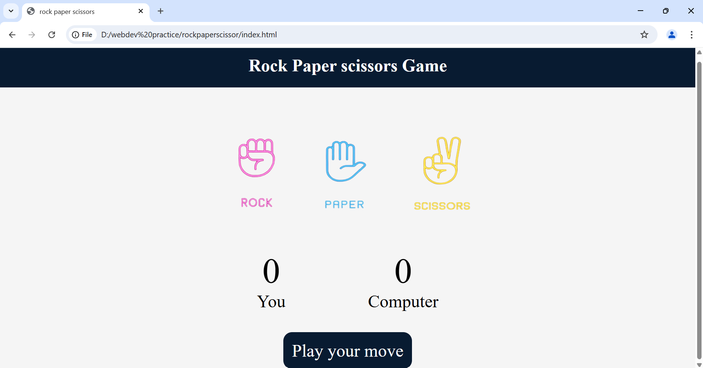

# Rock Paper Scissors Game 🎮

A simple web-based Rock Paper Scissors game built using HTML, CSS, and JavaScript.

## 🌟 Features
- User vs Computer gameplay
- Score tracking
- Responsive design
- Fun visuals

## 🛠️ Technologies Used

- HTML5
- CSS3
- JavaScript (Vanilla)

### 🔗 Live Demo  
👉 [Play the Game](https://gurusivananda.github.io/rockpaperscissor/)

## 📸 Screenshot

## 📂 Project Structure

📁 rockpaperscissor/ ├── index.html ├── style.css ├── app.js └── images/

## 🚀 How to Run
1. Clone this repository  
   `git clone https://github.com/gurusivananda/rockpaperscissor.git`
2. Open `index.html` in your browser

## 🙌 Author
Made with ❤️ by shiva

